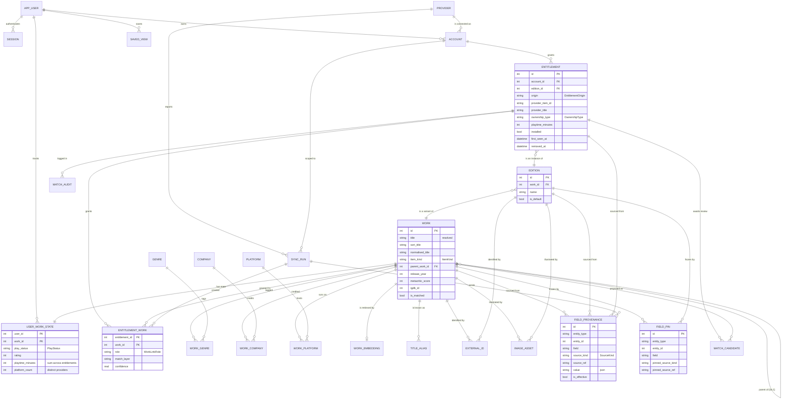

# Data model

The complete schema for Ludarium: entities, fields, relations, enums, indexes,
and the provenance mechanism behind architecture rules 3 and 5.

This is a design document. It defines intent; the SQLAlchemy models and the
first Alembic migration follow in M1 and must match what is written here.

---

## Conventions

| Topic | Decision |
|---|---|
| Primary keys | Surrogate `INTEGER` autoincrement (`BIGSERIAL` on PostgreSQL). Natural keys are enforced with `UNIQUE` constraints, never used as PKs |
| Timestamps | UTC, no local time anywhere. `TIMESTAMP` in SQLite (ISO-8601 text), `TIMESTAMPTZ` on PostgreSQL |
| Dates | `DATE` where the time of day is meaningless (`work.release_date`). ISO-8601 text in SQLite, native `DATE` on PostgreSQL |
| Enums | `TEXT` plus a `CHECK` constraint, not native PostgreSQL enum types. Adding a value must not require a type migration, and the values stay readable in a raw SQLite session |
| Booleans | `BOOLEAN` (`INTEGER` 0/1 in SQLite) |
| JSON | `TEXT` holding JSON in SQLite, `JSONB` on PostgreSQL. Used only for opaque payloads (matcher features, raw provider records), never for anything queried by a filter |
| Money / scores | `INTEGER` where the scale is fixed (Metacritic 0–100), `REAL` only for scores that are genuinely continuous (matcher confidence) |
| Naming | `snake_case`, singular table names, `*_at` for timestamps, `*_id` for FKs |
| Deletion | `ON DELETE RESTRICT` by default. Cascades exist only where a child row is meaningless without its parent (provenance, join tables, images) |
| Foreign keys | SQLite does not enforce them unless `PRAGMA foreign_keys = ON`, and the pragma is per connection, not per database. Every `ON DELETE` policy in this document depends on it being set on connect — the engine sets it in a pool listener, and a test asserts it is on |
| Vector search | `sqlite-vec` on SQLite, `pgvector` on PostgreSQL. Both store the vector alongside `work_embedding`; only the ANN index differs |
| Tenancy | Single-tenant. Every user-scoped table carries `user_id NOT NULL DEFAULT 1` so that multi-tenancy stays a UI question, not a migration (ADR-0003) |

---

## Enums

The three enums named in `CLAUDE.md` exist from day one, with every value, even
where nothing writes them yet.

| Enum | Values |
|---|---|
| `OwnershipType` | `owned`, `subscription`, `free`, `family_shared`, `trial`, `physical` |
| `ItemKind` | `game`, `dlc`, `demo`, `soundtrack`, `video`, `tool`, `mod` |
| `PlayStatus` | `not_started`, `playing`, `completed`, `mastered`, `dropped`, `on_hold`, `wishlist` |

Supporting enums introduced by this document:

| Enum | Values | Purpose |
|---|---|---|
| `SourceKind` | `manual`, `platform_api`, `local_agent`, `metadata_provider` | The precedence ladder of architecture rule 5, highest first |
| `ProviderKind` | `platform`, `metadata`, `agent`, `manual` | What a provider row represents |
| `LicenceClass` | `redistributable`, `runtime_only` | Whether data from a provider may leave the instance (IGDB and RAWG are `runtime_only`) |
| `EntitlementOrigin` | `sync`, `manual`, `import`, `agent` | How an entitlement entered the database. `manual` is immutable to sync (rule 2) |
| `WorkLinkRole` | `primary`, `granted` | On `entitlement_work`: the title the entitlement is named after, versus the extra works a bundle grants |
| `EntityType` | `work`, `edition`, `entitlement`, `account` | Discriminator for the polymorphic tables (`field_provenance`, `field_pin`, `external_id`, `image_asset`) |
| `FieldStrategy` | `precedence`, `max`, `sum`, `latest`, `agent_only`, `single_source`, `user_only`, `derived` | How a field resolves; see [Field resolution](#field-resolution) |
| `SyncStatus` | `pending`, `running`, `success`, `partial`, `failed` | Per-run and per-provider status (rule 4) |
| `SyncTrigger` | `manual`, `scheduled`, `ingest`, `import` | What started a run |
| `MatchLayer` | `hard_id`, `alias`, `fuzzy`, `llm`, `manual` | Which cascade layer produced a match |
| `MatchStatus` | `pending`, `accepted`, `rejected`, `superseded` | Review queue state |
| `ImageKind` | `cover`, `hero`, `logo`, `screenshot` | |
| `CompanyRole` | `developer`, `publisher`, `porting`, `support` | Publisher is a matcher feature, not decoration |

---

## Entities

### Identity and access

#### `app_user`

Single row in practice. Exists so `user_id` FKs point at something real.

| Column | Type | Null | Default | Notes |
|---|---|---|---|---|
| `id` | INTEGER | no | PK | |
| `username` | TEXT | no | | `UNIQUE` |
| `password_hash` | TEXT | no | | argon2id. Never leaves the backend |
| `locale` | TEXT | no | `'en'` | i18next language tag |
| `created_at` | TIMESTAMP | no | `now()` | |
| `last_login_at` | TIMESTAMP | yes | | |

#### `session`

| Column | Type | Null | Default | Notes |
|---|---|---|---|---|
| `id` | INTEGER | no | PK | |
| `user_id` | INTEGER | no | | FK → `app_user` |
| `token_hash` | TEXT | no | | SHA-256 of the cookie value; the raw token is never stored |
| `created_at` | TIMESTAMP | no | `now()` | |
| `expires_at` | TIMESTAMP | no | | |
| `user_agent` | TEXT | yes | | For a "sign out other devices" view |

### Providers and sync

#### `provider`

Seeded from code, not user-created. `manual`, `galaxy` and `agent` are provider
rows too, so that every entitlement has a source and no FK needs to be nullable.

| Column | Type | Null | Default | Notes |
|---|---|---|---|---|
| `id` | INTEGER | no | PK | |
| `key` | TEXT | no | | `UNIQUE`. `steam`, `gog`, `epic`, `ea`, `ubisoft`, `battlenet`, `igdb`, `rawg`, `galaxy`, `agent`, `manual` |
| `kind` | TEXT | no | | `ProviderKind` |
| `source_kind` | TEXT | no | | `SourceKind` this provider writes with |
| `licence_class` | TEXT | no | `'redistributable'` | `runtime_only` rows are excluded from every export |
| `display_name` | TEXT | no | | |
| `attribution_html` | TEXT | yes | | RAWG requires attribution and an active link wherever its data is displayed |
| `store_url_template` | TEXT | yes | | Takes `provider_item_id`, e.g. `https://store.steampowered.com/app/{id}`. We never launch a game, so a link to the store page is the answer to "where do I find this" |
| `precedence_weight` | INTEGER | no | `100` | Tie-break within one `SourceKind`; higher wins |
| `enabled` | BOOLEAN | no | `true` | |
| `status` | TEXT | no | `'pending'` | `SyncStatus` of the most recent run |
| `last_success_at` | TIMESTAMP | yes | | Rule 4: each provider reports its own health |
| `last_error` | TEXT | yes | | Message only, never a payload that could hold a token |

#### `account`

A connected account on a platform. Several per provider are allowed and
labelled (M4).

| Column | Type | Null | Default | Notes |
|---|---|---|---|---|
| `id` | INTEGER | no | PK | |
| `user_id` | INTEGER | no | `1` | FK → `app_user` |
| `provider_id` | INTEGER | no | | FK → `provider` |
| `external_account_id` | TEXT | yes | | SteamID64, GOG user id. Null for `manual` |
| `label` | TEXT | no | | "Main Steam", "Old account" |
| `is_derived` | BOOLEAN | no | `false` | The account was discovered inside an import rather than connected by the user. Has no credentials and is never synced directly — data reaches it only through whatever produced it |
| `credentials_encrypted` | BLOB | yes | | Fernet ciphertext. Never returned to the frontend, masked in the UI, excluded from logs and exports (rule 7) |
| `credentials_updated_at` | TIMESTAMP | yes | | |
| `is_active` | BOOLEAN | no | `true` | |
| `created_at` | TIMESTAMP | no | `now()` | |
| `last_success_at` | TIMESTAMP | yes | | |

`UNIQUE (provider_id, external_account_id)` where `external_account_id IS NOT NULL`.

#### `sync_run`

One row per attempt, per provider, per account. The ingest endpoint (rule 8)
creates the same row shape with `trigger = 'ingest'`, so a remote provider, the
future local agent and a manual upload are indistinguishable downstream.

| Column | Type | Null | Default | Notes |
|---|---|---|---|---|
| `id` | INTEGER | no | PK | |
| `provider_id` | INTEGER | no | | FK → `provider` |
| `account_id` | INTEGER | yes | | Null for metadata providers |
| `trigger` | TEXT | no | | `SyncTrigger` |
| `status` | TEXT | no | `'running'` | `SyncStatus` |
| `started_at` | TIMESTAMP | no | `now()` | |
| `finished_at` | TIMESTAMP | yes | | |
| `items_seen` | INTEGER | no | `0` | |
| `items_added` | INTEGER | no | `0` | |
| `items_updated` | INTEGER | no | `0` | |
| `items_removed` | INTEGER | no | `0` | Marked `removed_at`, never deleted |
| `error_text` | TEXT | yes | | |

#### Local imports and derived accounts

A `galaxy-2.0.db` upload is data read off the user's own machine, which is
exactly what the `local_agent` rung of rule 5 describes. It differs from the
future agent only in being a one-off upload instead of a daemon, so it needs no
new `SourceKind`.

| Concern | Decision |
|---|---|
| Who reports it | Provider `galaxy`, `kind = agent`, `source_kind = local_agent` |
| Who owns the entitlements | Derived accounts on `ea`, `ubisoft`, `battlenet` (`kind = platform`), created with `is_derived = true` and no credentials |
| Which `source_kind` lands on the provenance rows | The **reporting** provider's, not the account's. A Galaxy import writes `local_agent` rows even though the account belongs to `battlenet`. `provider.source_kind` on those three says `platform_api`, describing what they would write if we ever add real clients |
| `sync_run` shape | `provider_id = galaxy`, `account_id` = the derived account. This is the one case where a run's provider differs from its account's provider |
| CSV/JSON import | Runs against the `manual` provider with `source_kind = manual` and `origin = import`. It is the user asserting something, with no machine behind it |
| Re-import | The same upsert key as any sync, so a second upload updates rather than duplicates |

The consequence worth knowing: because Galaxy writes at `local_agent`, a real
`BattlenetProvider` added later would outrank it automatically, without a
migration or a precedence tweak.

### Catalogue

#### `work`

The canonical title, IGDB-anchored. Columns here hold **resolved** values only
— they are written by the resolver, never directly by a provider (see
[Provenance](#provenance-and-precedence)).

**Every entitlement has a work from the moment it is synced.** A new entitlement
gets a stub: a `work` row with `is_matched = false`, `title` copied from
`provider_title`, and a default `Standard` edition. Enrichment attaches the IGDB
anchor later and flips `is_matched`; matching merges stubs that turn out to be
the same game. There is no state in which an entitlement has no work
(ADR-0015).

This costs a table of near-duplicates early on and buys three things: the grid
is work-centric from M1, `user_work_state` has something to hang off so a status
can be set before anything is matched, and deduplication becomes
`merge_work(source, target)` — an operation rematching needs regardless — rather
than a creation with a different code path.

| Column | Type | Null | Default | Notes |
|---|---|---|---|---|
| `id` | INTEGER | no | PK | |
| `title` | TEXT | no | | Canonical title from the IGDB anchor once `is_matched`; on a stub it is a copy of the primary entitlement's `provider_title`. Store names are not a *source* here — they live on `entitlement.provider_title` |
| `sort_title` | TEXT | no | | Leading article moved, so "The Witcher 3" files under W; drives keyset pagination. Display logic, and it stays in Ludarium |
| `normalised_title` | TEXT | yes | | Matcher normalisation output: lowercased, punctuation and edition markers stripped, roman numerals folded. Nullable because it is `ludamatch`'s output (MIT, separate repository) and nothing writes it before M2 — populating it here would put matcher code in the wrong repository, to be extracted later. `sort_title` is the display-side counterpart and stays `NOT NULL` |
| `item_kind` | TEXT | no | `'game'` | `ItemKind` |
| `parent_work_id` | INTEGER | yes | | Self-FK. DLC folded under its parent game in the grid (M3) |
| `release_year` | INTEGER | yes | | Year only; day-level precision is noise for filtering |
| `release_date` | DATE | yes | | Kept when known |
| `summary` | TEXT | yes | | |
| `metacritic_score` | INTEGER | yes | | 0–100, RAWG-sourced, `runtime_only` |
| `metacritic_url` | TEXT | yes | | Required for the attribution link |
| `igdb_id` | INTEGER | yes | | Denormalised anchor for fast lookups; authoritative copy lives in `external_id` |
| `is_matched` | BOOLEAN | no | `false` | True once an IGDB anchor exists |
| `enriched_at` | TIMESTAMP | yes | | Enrichment pipeline skips anything fresher than the TTL (M2) |
| `created_at` | TIMESTAMP | no | `now()` | |
| `updated_at` | TIMESTAMP | no | `now()` | |

#### `edition`

Differs from its work in bundled content, not in identity. Every work has at
least one edition — a stub is created with a default `Standard` — and a provider
entry with no edition information attaches to it.

| Column | Type | Null | Default | Notes |
|---|---|---|---|---|
| `id` | INTEGER | no | PK | |
| `work_id` | INTEGER | no | | FK → `work`, `ON DELETE CASCADE` |
| `name` | TEXT | no | | "Standard", "Game of the Year", "Complete" |
| `slug` | TEXT | no | | `UNIQUE (work_id, slug)` |
| `is_default` | BOOLEAN | no | `false` | Exactly one per work |
| `created_at` | TIMESTAMP | no | `now()` | |

#### `external_id`

Backbone of matching layer 1 and the only place an ID from another system is
authoritative.

| Column | Type | Null | Default | Notes |
|---|---|---|---|---|
| `id` | INTEGER | no | PK | |
| `entity_type` | TEXT | no | | `EntityType`, `work` or `edition` |
| `entity_id` | INTEGER | no | | |
| `namespace` | TEXT | no | | `igdb`, `steam`, `gog`, `epic`, `rawg`, `wikidata` |
| `value` | TEXT | no | | Steam appid, GOG product id, IGDB slug or numeric id |
| `is_authoritative` | BOOLEAN | no | `false` | True when it came from IGDB `external_games`, false when inferred by the matcher |
| `source_ref` | TEXT | yes | | Provider key that asserted it |
| `created_at` | TIMESTAMP | no | `now()` | |

`UNIQUE (namespace, value, entity_type)`.

#### `genre`, `work_genre`

| Column | Type | Null | Default | Notes |
|---|---|---|---|---|
| `genre.id` | INTEGER | no | PK | |
| `genre.slug` | TEXT | no | | `UNIQUE` |
| `genre.name` | TEXT | no | | English; the UI translates via i18next keys where a translation exists |
| `work_genre.work_id` | INTEGER | no | | FK, PK part, `ON DELETE CASCADE` |
| `work_genre.genre_id` | INTEGER | no | | FK, PK part |
| `work_genre.source_ref` | TEXT | yes | | Which provider asserted the genre |

#### `company`, `work_company`

Publisher and developer are matcher features (feature-based adjudication), not
only display data.

| Column | Type | Null | Default | Notes |
|---|---|---|---|---|
| `company.id` | INTEGER | no | PK | |
| `company.name` | TEXT | no | | |
| `company.normalised_name` | TEXT | no | | For comparison in the matcher |
| `company.igdb_id` | INTEGER | yes | | `UNIQUE` where not null |
| `work_company.work_id` | INTEGER | no | | FK, PK part, `ON DELETE CASCADE` |
| `work_company.company_id` | INTEGER | no | | FK, PK part |
| `work_company.role` | TEXT | no | | `CompanyRole`, PK part |

#### `platform`, `work_platform`

The hardware or OS a work runs on — distinct from the store it was bought
from. Platform overlap is a matcher feature.

| Column | Type | Null | Default | Notes |
|---|---|---|---|---|
| `platform.id` | INTEGER | no | PK | |
| `platform.slug` | TEXT | no | | `UNIQUE`. `pc`, `ps5`, `switch` |
| `platform.name` | TEXT | no | | |
| `work_platform.work_id` | INTEGER | no | | FK, PK part, `ON DELETE CASCADE` |
| `work_platform.platform_id` | INTEGER | no | | FK, PK part |

#### `image_asset`

| Column | Type | Null | Default | Notes |
|---|---|---|---|---|
| `id` | INTEGER | no | PK | |
| `entity_type` | TEXT | no | | `work` or `edition` |
| `entity_id` | INTEGER | no | | |
| `kind` | TEXT | no | | `ImageKind` |
| `source_ref` | TEXT | no | | Provider key; also decides whether the file may be exported |
| `remote_url` | TEXT | yes | | |
| `local_path` | TEXT | yes | | Relative to the data volume |
| `checksum` | TEXT | yes | | Deduplicates identical covers across providers |
| `width` / `height` | INTEGER | yes | | Lets the grid reserve space before load |
| `fetched_at` | TIMESTAMP | yes | | Null means queued, not yet downloaded |

#### `work_embedding`

The retriever, not the decider. The document embedded is always composite —
title, year, publisher, platforms — never a bare title.

| Column | Type | Null | Default | Notes |
|---|---|---|---|---|
| `work_id` | INTEGER | no | PK | FK → `work`, `ON DELETE CASCADE` |
| `model_name` | TEXT | no | | e.g. `BAAI/bge-small-en-v1.5` |
| `model_version` | TEXT | no | | Changing either invalidates the whole index |
| `dimensions` | INTEGER | no | | |
| `document_hash` | TEXT | no | | Skip re-embedding when the composite document has not changed |
| `vector` | BLOB | no | | Mirrored into a `sqlite-vec` virtual table for ANN search; `pgvector` on PostgreSQL |
| `created_at` | TIMESTAMP | no | `now()` | |

#### `title_alias`

Local copy of `ludamatch-data` (CC0, redistributable). Rebuilt wholesale on
import; never edited in place.

| Column | Type | Null | Default | Notes |
|---|---|---|---|---|
| `id` | INTEGER | no | PK | |
| `work_id` | INTEGER | yes | | Null until the alias resolves to a local work |
| `external_ref` | TEXT | yes | | Wikidata QID or IGDB id the alias belongs to |
| `alias` | TEXT | no | | |
| `normalised_alias` | TEXT | no | | |
| `locale` | TEXT | yes | | |
| `dataset_version` | TEXT | no | | Which `ludamatch-data` release this row came from |

### Ownership

#### `entitlement`

What the user actually owns, on one account. This is the row a sync touches.

| Column | Type | Null | Default | Notes |
|---|---|---|---|---|
| `id` | INTEGER | no | PK | |
| `user_id` | INTEGER | no | `1` | |
| `account_id` | INTEGER | no | | FK → `account` |
| `edition_id` | INTEGER | yes | | Which edition was bought — the stub's `Standard` until something better is known. Nullable only for the moment between insert and stub creation inside one transaction. Not the route to the work: see the `primary` link in `entitlement_work` |
| `origin` | TEXT | no | `'sync'` | `EntitlementOrigin`. `manual` is immutable to sync (rule 2) |
| `provider_item_id` | TEXT | yes | | Steam appid, GOG product id. Null for `manual` |
| `provider_title` | TEXT | no | | Exactly as the platform returned it, always requested in English. Never overwritten by metadata; it is the matcher's input and the fallback display title |
| `ownership_type` | TEXT | no | `'owned'` | `OwnershipType` |
| `item_kind` | TEXT | yes | | As reported by the provider; the resolved value lives on `work` |
| `playtime_minutes` | INTEGER | yes | | Playtime on this one account. Where two sources report it for the same entitlement — the platform API and the local agent — the higher figure wins, because the lower one is stale |
| `last_played_at` | TIMESTAMP | yes | | |
| `installed` | BOOLEAN | yes | | Local agent only |
| `install_path` | TEXT | yes | | Local agent only |
| `acquired_at` | TIMESTAMP | yes | | Where the platform exposes it |
| `first_seen_at` | TIMESTAMP | no | `now()` | Set once, never updated |
| `last_seen_at` | TIMESTAMP | no | `now()` | Touched by every run that still sees the item |
| `removed_at` | TIMESTAMP | yes | | Set when a run no longer sees the item. Never a `DELETE` (rule 1) |
| `removed_by_run_id` | INTEGER | yes | | FK → `sync_run`, for the audit trail |
| `raw_payload` | JSON | yes | | Last provider record, for debugging a bad match. Token fields stripped before storage |

`UNIQUE (account_id, provider_item_id)` where `provider_item_id IS NOT NULL`.

#### `entitlement_work`

The many-to-many. One entitlement can grant several works — a bundle, a season
pass, a GOTY edition that includes its expansions as separate IGDB entries. One
work can be reached by several entitlements — the same game owned on Steam and
on GOG.

| Column | Type | Null | Default | Notes |
|---|---|---|---|---|
| `entitlement_id` | INTEGER | no | PK part | FK, `ON DELETE CASCADE` |
| `work_id` | INTEGER | no | PK part | FK, `ON DELETE CASCADE` |
| `role` | TEXT | no | `'primary'` | `WorkLinkRole`. Exactly one `primary` per entitlement, and it is the single source of truth for which work the entitlement belongs to |
| `match_layer` | TEXT | yes | | `MatchLayer` that created the link |
| `confidence` | REAL | yes | | Null for hard IDs and manual links |
| `created_at` | TIMESTAMP | no | `now()` | |
| `created_by_run_id` | INTEGER | yes | | FK → `sync_run` |

### User state

#### `user_work_state`

Everything the user decides, plus the aggregates the grid sorts on. Kept
separate from `work` so that a metadata refresh can never touch it.

| Column | Type | Null | Default | Notes |
|---|---|---|---|---|
| `user_id` | INTEGER | no | PK part | |
| `work_id` | INTEGER | no | PK part | FK, `ON DELETE CASCADE` |
| `play_status` | TEXT | no | `'not_started'` | `PlayStatus` |
| `rating` | INTEGER | yes | | 1–10, `CHECK` |
| `notes` | TEXT | yes | | |
| `is_favourite` | BOOLEAN | no | `false` | |
| `is_hidden` | BOOLEAN | no | `false` | Excluded from the default grid without being removed |
| `playtime_minutes` | INTEGER | no | `0` | Aggregate: **sum** over non-removed entitlements whose `primary` link is this work. Two accounts are two stretches of play, not two reports of one |
| `last_played_at` | TIMESTAMP | yes | | Aggregate: latest across the same entitlements |
| `platform_count` | INTEGER | no | `0` | Distinct providers among non-removed entitlements linked to this work. Denormalised on resolve so "owned on more than one platform" is an indexed comparison instead of an aggregate per row |
| `started_at` / `completed_at` | TIMESTAMP | yes | | |
| `updated_at` | TIMESTAMP | no | `now()` | |

#### `saved_view`

M3 stores filter state in the URL; a saved view is that query string with a
name on it.

| Column | Type | Null | Default | Notes |
|---|---|---|---|---|
| `id` | INTEGER | no | PK | |
| `user_id` | INTEGER | no | `1` | |
| `name` | TEXT | no | | `UNIQUE (user_id, name)` |
| `query` | TEXT | no | | The URL query string, parsed through the same filter registry as a live request |
| `is_default` | BOOLEAN | no | `false` | |
| `position` | INTEGER | no | `0` | Manual ordering in the sidebar |
| `created_at` | TIMESTAMP | no | `now()` | |

### Provenance

#### `field_provenance`

What every source currently asserts for a field, kept side by side. This is what
lets the UI say "from Steam" and offer the alternatives.

It is a snapshot, not a log. When a source changes its value the row is updated
in place, so "Steam used to call it X" is not recoverable. That is a deliberate
trade-off, consistent with keeping an audit trail only where a decision has to
be reversible (`match_audit`): the cost of a full field history is a table that
grows with every sync forever, and nothing in the product reads it.

| Column | Type | Null | Default | Notes |
|---|---|---|---|---|
| `id` | INTEGER | no | PK | |
| `entity_type` | TEXT | no | | `EntityType` |
| `entity_id` | INTEGER | no | | |
| `field` | TEXT | no | | Column name on the target entity, e.g. `title`, `release_year` |
| `source_kind` | TEXT | no | | `SourceKind` |
| `source_ref` | TEXT | no | | Provider key, or `account:12` where the same provider has several accounts |
| `value` | TEXT | yes | | JSON-encoded scalar. Null means "this source explicitly has no value", which is different from having no row |
| `is_effective` | BOOLEAN | no | `false` | Exactly one true row per (entity, field) once resolved, enforced by a partial unique index |
| `observed_at` | TIMESTAMP | no | `now()` | |
| `run_id` | INTEGER | yes | | FK → `sync_run`. Null for user edits |

`UNIQUE (entity_type, entity_id, field, source_kind, source_ref)` — one row per
source per field, updated in place as the source changes its mind.

#### `field_pin`

A user's decision to freeze a field to one source. Distinct from an override: a
pin says *keep using GOG's cover*, an override says *use this exact value*.

| Column | Type | Null | Default | Notes |
|---|---|---|---|---|
| `id` | INTEGER | no | PK | |
| `entity_type` | TEXT | no | | |
| `entity_id` | INTEGER | no | | |
| `field` | TEXT | no | | |
| `pinned_source_kind` | TEXT | no | | `SourceKind` |
| `pinned_source_ref` | TEXT | no | | |
| `created_at` | TIMESTAMP | no | `now()` | |

`UNIQUE (entity_type, entity_id, field)`.

### Matching

#### `match_candidate`

The manual review queue. A false positive is worse than a false negative, so a
low-confidence pair lands here instead of being merged.

| Column | Type | Null | Default | Notes |
|---|---|---|---|---|
| `id` | INTEGER | no | PK | |
| `entitlement_id` | INTEGER | no | | FK → `entitlement` |
| `work_id` | INTEGER | no | | FK → `work` |
| `layer` | TEXT | no | | `MatchLayer` |
| `score` | REAL | no | | Classifier output, not raw cosine |
| `features` | JSON | yes | | Year delta, publisher match, platform overlap, cosine, fuzzy ratio — kept so a decision can be explained and the golden set can be rebuilt |
| `status` | TEXT | no | `'pending'` | `MatchStatus` |
| `decided_at` | TIMESTAMP | yes | | |
| `decided_by` | TEXT | yes | | `auto` or `user` |
| `run_id` | INTEGER | yes | | FK → `sync_run` |

#### `match_audit`

Every automatic merge is reversible and leaves a trail.

| Column | Type | Null | Default | Notes |
|---|---|---|---|---|
| `id` | INTEGER | no | PK | |
| `entitlement_id` | INTEGER | yes | | Null for `merged`, which is work-to-work and touches many entitlements at once |
| `work_id` | INTEGER | no | | The surviving work for `merged` |
| `action` | TEXT | no | | `linked`, `unlinked`, `relinked`, `merged` |
| `layer` | TEXT | yes | | `MatchLayer` |
| `previous_work_id` | INTEGER | yes | | Enough to undo a relink; the deleted source for `merged` |
| `details` | JSON | yes | | Undo payload for a `merged` action: the deleted source work's row and the ids of every row moved with it |
| `actor` | TEXT | no | | `auto` or `user` |
| `created_at` | TIMESTAMP | no | `now()` | |

---

## ER diagram

---

## Relations

| Relation | Cardinality | Note |
|---|---|---|
| `provider` → `account` | 1:N | Several accounts per platform, labelled (M4) |
| `account` → `entitlement` | 1:N | |
| `work` → `edition` | 1:N | Every work has a default edition, stubs included |
| `edition` → `entitlement` | 1:N | Set at stub creation; nullable only inside the creating transaction |
| `entitlement` ↔ `work` | **N:M** via `entitlement_work` | See below |
| `work` → `work` | 1:N self | `parent_work_id`; DLC folded under its parent in the grid |
| `work` ↔ `genre` / `company` / `platform` | N:M | |
| `work` → `user_work_state` | 1:1 per user | |
| any entity → `field_provenance` | 1:N polymorphic | |

### Why Entitlement ↔ Work is many-to-many

Both directions are real, which is why neither side can hold a plain FK:

| Direction | Case |
|---|---|
| One entitlement → many works | A GOTY edition or a bundle grants the base game plus expansions, each a separate IGDB work. One purchase, several catalogue entries |
| One work → many entitlements | The same game owned on Steam and on GOG. The grid shows one card with two platform badges |

`edition_id` on `entitlement` is not a duplicate of this link. It answers *what
was bought* (one edition, hence a plain FK); `entitlement_work` answers *what it
grants* (many works). `role = 'primary'` marks the work the entitlement is named
after, and it — not `edition_id` — is the single source of truth for which work
an entitlement belongs to.

### Cross-platform ownership

The Work layer is what stops the same game appearing three times because it was
bought three times.

| Question | Answer in the schema |
|---|---|
| I own this on Steam and Epic | One `work` row, two `entitlement` rows, both linked with `role = 'primary'`. One card in the grid, one platform badge per entitlement |
| Which version do I have, and where? | Each entitlement carries its own `edition_id`, so the card reads "GOG: GOTY · Steam: Standard" instead of collapsing to a single edition |
| How many platforms is this on? | `user_work_state.platform_count`, recomputed on resolve |
| Where do I actually get it? | `provider.store_url_template` filled with `entitlement.provider_item_id` |

Deduplication is a side effect of matching, not a feature of its own. Both
entitlements arrive as their own stub, so the same game bought twice is two
cards until a cascade layer establishes that the stubs are one work and merges
them. Two cards for one game is the honest intermediate state — merging on a
guess would be a false positive, and a false positive is worse than a false
negative (rule 6).

The practical consequence: hard-ID deduplication starts in **M2** with cascade
layer 1, alongside the IGDB client that gives stubs their anchors; alias-based
deduplication follows in **M4** with layer 2 and the second and third platform.
Before M2 there is one platform connected and nothing to deduplicate anyway.

### Merging stubs

`merge_work(source, target)` folds one work into another. The target is the one
carrying the IGDB anchor; where neither is matched, the older row wins. Every
table that references the source is dealt with explicitly:

| Table | Action on merge |
|---|---|
| `entitlement_work` | Links move to the target. A `primary` link that would collide with an existing `primary` for the same entitlement becomes `granted` |
| `edition` | Re-parented to the target, deduplicated by `slug`. `entitlement.edition_id` is repointed to the surviving edition; a stub's `Standard` collapses into the target's default |
| `user_work_state` | Merged, not moved: user-set fields take the source's value only where the target still holds the default. `playtime_minutes` and `platform_count` are recomputed by the resolver afterwards, not copied |
| `field_provenance` | Rows move. On collision with the target's row for the same `(field, source_kind, source_ref)` the later `observed_at` survives. `is_effective` is cleared across the field and the resolver runs again |
| `field_pin` | Moves, unless the target already pins that field, in which case the target's pin stands |
| `external_id` | Moves; duplicates by `(namespace, value)` are dropped |
| `work_genre`, `work_company`, `work_platform` | Moved, duplicates dropped |
| `image_asset` | Moved; `checksum` deduplicates identical covers |
| `work_embedding` | Source row deleted, target re-embedded — the composite document changed |
| `title_alias`, `match_candidate`, `match_audit` | `work_id` repointed |
| `work.parent_work_id` | Children of the source are repointed at the target, and a source that was itself a child carries its parent over only if the target has none. Missing this leaves the `ON DELETE RESTRICT` on the self-FK blocking the final delete |
| `work` (source) | Deleted last, in the same transaction |

The merge writes a `match_audit` row with `action = 'merged'` and a `details`
payload holding the source work and the ids of everything moved, which is what
makes it reversible under rule 6. Reversibility matters more here than for a
plain link: a merge is the one matcher action that destroys a row.

**Orphaned stubs** accumulate — a stub whose last entitlement was removed, or
whose links all moved elsewhere in a rematch. A periodic job deletes works that
have no `entitlement_work` rows, are not matched, and carry no user-authored
state (no `user_work_state` beyond defaults, no `manual` provenance). Anything
failing those tests is kept and surfaced, not silently dropped.

---

## Provenance and precedence

### The invariant

> A provider never writes an entity column. It writes `field_provenance` rows.
> Only the resolver writes entity columns.

This is what makes rules 3 and 5 enforceable rather than aspirational. A sync
that goes rogue can at worst add a losing provenance row.

### Field resolution

Resolution runs after any sync run that touched an entity, and after any user
edit. For each (entity, field):

1. **Pin** — if a `field_pin` row exists, take the value from that exact
   `(source_kind, source_ref)`. If that source currently has no value, the field
   resolves to null rather than silently falling through; a pin that stops
   producing a value is visible in the UI instead of being quietly replaced.
2. **User override** — a `field_provenance` row with `source_kind = 'manual'`
   wins over everything else (rule 3). It is never overwritten by a later sync,
   because a sync writes with its own `source_kind` and cannot touch a manual
   row.
3. **Strategy** — otherwise apply the field's strategy from the registry below.
4. Write the winner to the entity column, then clear `is_effective` on the
   previous winner and set it on the new one, in that order and in one
   transaction — the partial unique index rejects a moment with two winners,
   which is the point of having it.

Default strategy is `precedence`: `manual > platform_api > local_agent >
metadata_provider`, ties inside one `SourceKind` broken by
`provider.precedence_weight`, then by the most recent `observed_at`.

Precedence only decides between sources asserting **the same concept**. A store
name and a canonical work title are two different fields, not two candidates for
one field, so platforms are not a source for `work.title` at all — their names
live on `entitlement.provider_title`, where nothing overwrites them. This is
what rule 5 means, not an exception to it. Treating them as competing values has
a concrete failure mode: the title on a card would change depending on which
platform synced most recently, so the same game would read "The Witcher 3: Wild
Hunt" after a Steam sync and "The Witcher 3: Wild Hunt - Game of the Year
Edition" after a GOG one. A Work layer that cannot hold a stable name is not
doing its job.

| Field | Entity | Strategy | Reason |
|---|---|---|---|
| `title` | `work` | `single_source` | The IGDB anchor once `is_matched`. On a stub it is a copy of the primary entitlement's `provider_title`, taken at creation — a derived value, not a provenance row, which is how platforms stay out of this field while a stub still has a name |
| `sort_title`, `summary`, `release_year`, `release_date` | `work` | `precedence` | Genuinely competing assertions about one fact |
| `item_kind` | `work` | `precedence` | Platforms mislabel DLC often enough that a manual override matters |
| `cover` (via `image_asset`) | `work`, `edition` | `precedence` | Commonly pinned; store art differs per platform |
| `metacritic_score`, `metacritic_url` | `work` | `single_source` | RAWG only. No competition, so no ladder |
| `name` | `edition` | `precedence` | |
| `playtime_minutes` | `entitlement` | `max` | Rule 5 exception, *within* one entitlement: the Steam API and the local agent describe the same play on the same account, and the lower figure is the stale one |
| `playtime_minutes` | `user_work_state` | `sum` | Aggregate *across* entitlements: 40 hours on Steam plus 20 on GOG is 60 hours played. Different accounts are different play, not duplicate reports |
| `last_played_at` | `user_work_state` | `latest` | |
| `platform_count` | `user_work_state` | `derived` | Count of distinct providers, not a sourced value |
| `installed`, `install_path` | `entitlement` | `agent_only` | Rule 5 exception: only the local agent can know |
| `provider_title`, `provider_item_id` | `entitlement` | `single_source` | Owned by the account's provider by definition |
| `play_status`, `rating`, `notes`, `is_favourite` | `user_work_state` | `user_only` | No provider ever writes these |

The registry lives in code as a declarative table, mirroring the filter registry
in M3. It is not a database table: it changes with the code, not with the data.

### What the UI gets

`GET /api/works/{id}/fields/{field}` returns every provenance row for the field.
For `item_kind` on Hearts of Stone, which Steam sells as a standalone product
and IGDB records as an expansion — the override that gives work 101 its `dlc`
kind in the worked example below:

| Value | Source | Observed | State |
|---|---|---|---|
| `dlc` | You | 2026-05-03 | effective |
| `game` | Steam | 2026-05-01 | would win on precedence |
| `dlc` | IGDB | 2026-05-02 | |

That is enough to render the value with its source, list the alternatives, and
offer two actions: **pin to this source** (writes `field_pin`) or **edit**
(writes a `manual` provenance row). Both are reversible by deleting the row,
which returns the field to normal resolution — here, back to Steam's `game`.

### Export and licence classes

`provider.licence_class = 'runtime_only'` marks IGDB and RAWG. Any export or
backup walks `field_provenance` and drops values whose effective source is
`runtime_only`, along with the images those providers supplied. Nothing from
IGDB or RAWG ships inside the repository or the Docker image; the alias dataset
(`title_alias`, CC0) is the only bundled catalogue data.

---

## Lifecycle and immutability

| Concern | Representation |
|---|---|
| First appearance | `entitlement.first_seen_at`, set on insert, never updated. Survives a removal and a later restore, so "owned since" stays true |
| Still present | `entitlement.last_seen_at`, touched by every successful run that sees the item |
| Disappearance | `entitlement.removed_at` set, plus `removed_by_run_id`. The row stays, the links stay, its own playtime stays (rule 1). The work-level aggregates in `user_work_state` are recomputed from non-removed entitlements, so a removed entitlement stops counting until it is restored |
| Removed view | `WHERE removed_at IS NOT NULL`, with a one-click restore that nulls `removed_at` and `removed_by_run_id` |
| Default grid | Every library query carries `removed_at IS NULL` |
| Partial failure | A run that ends `failed` or `partial` marks nothing as removed. Only a `success` run may set `removed_at`, or an Epic outage would empty the Epic library |
| Manual immutability | `entitlement.origin = 'manual'` is excluded from every sync query by predicate, not by convention. Manual rows have `provider_item_id IS NULL`, so they can never collide with the `UNIQUE (account_id, provider_item_id)` upsert key that sync uses (rule 2) |
| User edits | A `manual` provenance row, which sync cannot overwrite because it writes under a different `source_kind` (rule 3) |
| Provider isolation | `sync_run` and the status columns are per provider and per account. One provider's failure changes no other provider's rows (rule 4) |
| Which work an entitlement belongs to | The `entitlement_work` row with `role = 'primary'`, and nothing else. `edition_id` records only which edition was bought; its `edition.work_id` must agree with the primary link. Both are written in one transaction on match and on rematch |
| Work creation | A stub work and its default edition are created in the same transaction as the entitlement, so no entitlement is ever work-less (ADR-0015). Stubs left behind by removal or rematch are collected by the orphan job described under [Merging stubs](#merging-stubs) |
| Enforcing that agreement | A test, not a constraint. SQLite cannot express "`edition_id → edition.work_id` equals the `work_id` of this entitlement's `primary` link" as a `CHECK` — it spans three tables. The invariant is asserted in the matcher's test suite and by a consistency check the health endpoint can run |

---

## Deliberately not in the schema

**Demo mode** (M3) is an instance-level environment variable,
`LUDARIUM_DEMO_MODE`, not a database flag. While it is set the backend rejects
writes to credential fields and refuses the sync endpoints outright; the seed
dataset is ordinary rows loaded from a fixture. A column would have to be
checked at every write site and would eventually be missed at one of them,
whereas a refusal at the edge is one decision in one place. Nothing in the
schema changes, and a demo database is a normal database.

---

## Indexes

Sized for the M3 filter set. The canonical library query is work-centric:
filters on `work` and `user_work_state` apply directly, ownership filters apply
through `EXISTS` over `entitlement_work` → `entitlement`.

### Filter and sort support

| Filter (M3) | Index |
|---|---|
| Platform | `entitlement_work (work_id, entitlement_id)` and `entitlement (account_id, removed_at)`; the store is reached via `account.provider_id` |
| Metacritic | `work (metacritic_score) WHERE metacritic_score IS NOT NULL` |
| Genre | `work_genre (genre_id, work_id)` — the reverse of the PK, for "all RPGs" |
| Year | `work (release_year)` |
| Playtime | `user_work_state (user_id, playtime_minutes)` |
| `ItemKind` | `work (item_kind, sort_title)` — filter and default sort in one |
| `PlayStatus` | `user_work_state (user_id, play_status, work_id)` |
| Ownership type | `entitlement (ownership_type) WHERE removed_at IS NULL` |
| Removed view | `entitlement (removed_at) WHERE removed_at IS NOT NULL` |
| Owned on several platforms (`platform_count >= 2`) | `user_work_state (user_id, platform_count)` |
| Favourites / hidden | `user_work_state (user_id, is_favourite) WHERE is_favourite` |
| DLC folding | `work (parent_work_id) WHERE parent_work_id IS NOT NULL` |
| Search (M2) | SQLite: FTS5 virtual table `work_fts(title, normalised_title, summary)` over `work` columns only. PostgreSQL: `pg_trgm` GIN on `work.normalised_title`. Store titles are not in it — `provider_title` lives on `entitlement`, and searching it is a separate query against `entitlement (provider_title)`, unioned into the results |
| Default grid order | `work (sort_title, id)` — keyset pagination for the virtualised grid |

### Structural indexes

| Table | Index | Purpose |
|---|---|---|
| `entitlement` | `UNIQUE (account_id, provider_item_id) WHERE provider_item_id IS NOT NULL` | The sync upsert key; also what keeps manual rows out of sync's way |
| `entitlement` | `(edition_id)` | Edition → owners |
| `entitlement_work` | PK `(entitlement_id, work_id)` + `(work_id, entitlement_id)` | Both traversal directions are hot |
| `entitlement_work` | `UNIQUE (entitlement_id) WHERE role = 'primary'` | "Exactly one `primary` per entitlement" is the single source of truth for which work an entitlement belongs to, so it is an index rather than a convention — the same reasoning as the `is_effective` guard below |
| `work_platform` | `(platform_id, work_id)` | Reverse of the PK, matching `work_genre`. Platform overlap is a matcher feature, so it is read per candidate pair, not only for display |
| `work_company` | `(company_id, work_id, role)` | Same, for the publisher feature |
| `entitlement` | `(provider_title)` | The store-title half of search, which `work_fts` cannot cover |
| `field_provenance` | `UNIQUE (entity_type, entity_id, field, source_kind, source_ref)` | One row per source per field |
| `field_provenance` | `UNIQUE (entity_type, entity_id, field) WHERE is_effective` | Both the lookup path for the resolver and the detail view, and the guard on the flag. `is_effective` is a denormalisation; without this index a half-finished resolve could leave two winners for one field and nothing would notice |
| `field_pin` | `UNIQUE (entity_type, entity_id, field)` | |
| `external_id` | `UNIQUE (namespace, value, entity_type)` + `(entity_type, entity_id)` | Matching layer 1, both directions |
| `work` | `UNIQUE (igdb_id) WHERE igdb_id IS NOT NULL` | |
| `title_alias` | `(normalised_alias)`, `(work_id)` | Matching layer 2 |
| `sync_run` | `(provider_id, started_at DESC)`, `(account_id, status, started_at DESC)` | Per-provider status panel |
| `match_candidate` | `(status, score DESC) WHERE status = 'pending'` | The review queue |
| `image_asset` | `(entity_type, entity_id, kind)` | |
| `session` | `(token_hash)` unique, `(expires_at)` | Lookup and cleanup |

If the work-centric query with two `EXISTS` clauses stops being fast enough at
tens of thousands of entitlements, the answer is a denormalised read table
rebuilt on sync, not wider indexes. Not needed at M3 scale; noted so it is not
reinvented under pressure.

---

## Worked example

The Witcher 3, owned twice: the base game on Steam, the Game of the Year
edition on GOG. Plus a disc copy added by hand, to show rule 2.

**`provider`**

| id | key | kind | source_kind | licence_class |
|---|---|---|---|---|
| 1 | `steam` | platform | platform_api | redistributable |
| 2 | `gog` | platform | platform_api | redistributable |
| 3 | `manual` | manual | manual | redistributable |
| 4 | `igdb` | metadata | metadata_provider | runtime_only |
| 5 | `rawg` | metadata | metadata_provider | runtime_only |

**`account`**

| id | provider_id | external_account_id | label |
|---|---|---|---|
| 10 | 1 | `7656119…` | Main Steam |
| 11 | 2 | `4915…` | GOG |
| 12 | 3 | null | Manual entries |

**`work`** — three rows, because GOTY grants two expansions that IGDB models
separately.

| id | title | item_kind | parent_work_id | release_year | igdb_id | metacritic_score |
|---|---|---|---|---|---|---|
| 100 | The Witcher 3: Wild Hunt | game | null | 2015 | 1942 | 92 |
| 101 | Hearts of Stone | dlc | 100 | 2015 | 11156 | null |
| 102 | Blood and Wine | dlc | 100 | 2016 | 18866 | null |

**`edition`**

| id | work_id | name | is_default |
|---|---|---|---|
| 200 | 100 | Standard | true |
| 201 | 100 | Game of the Year | false |

**`external_id`**

| entity_type | entity_id | namespace | value | is_authoritative |
|---|---|---|---|---|
| work | 100 | igdb | 1942 | true |
| edition | 200 | steam | 292030 | true |
| edition | 201 | gog | 1495134320 | true |
| work | 100 | rawg | the-witcher-3-wild-hunt | true |

**`entitlement`**

| id | account_id | edition_id | origin | provider_item_id | provider_title | ownership_type | playtime_minutes | first_seen_at | removed_at |
|---|---|---|---|---|---|---|---|---|---|
| 300 | 10 | 200 | sync | 292030 | The Witcher 3: Wild Hunt | owned | 4200 | 2026-03-02 | null |
| 301 | 11 | 201 | sync | 1495134320 | The Witcher 3: Wild Hunt - Game of the Year Edition | owned | 900 | 2026-04-11 | null |
| 302 | 12 | 200 | manual | null | The Witcher 3 (Xbox One disc) | physical | null | 2026-04-20 | null |

This is the state after matching. Entitlements 300 and 301 arrived as two
separate stubs — "The Witcher 3: Wild Hunt" and "The Witcher 3: Wild Hunt - Game
of the Year Edition", two cards in the grid — and layer 1 merged the GOG stub
into the Steam one on the shared IGDB id, keeping the GOTY edition row and
repointing entitlement 301 at it.

**`entitlement_work`** — the many-to-many, doing real work: one GOG purchase
grants three catalogue entries.

| entitlement_id | work_id | role | match_layer | confidence |
|---|---|---|---|---|
| 300 | 100 | primary | hard_id | null |
| 301 | 100 | primary | hard_id | null |
| 301 | 101 | granted | alias | 0.97 |
| 301 | 102 | granted | alias | 0.97 |
| 302 | 100 | primary | manual | null |

Work 100 is one card in the grid with three platform badges. Works 101 and 102
fold under it as DLC.

**`field_provenance`** for work 100 (abridged)

| field | source_kind | source_ref | value | is_effective |
|---|---|---|---|---|
| `title` | metadata_provider | igdb | `"The Witcher 3: Wild Hunt"` | **true** |
| `sort_title` | manual | user | `"Witcher 3, The: Wild Hunt"` | **true** |
| `release_year` | platform_api | gog | `2015` | **true** |
| `release_year` | metadata_provider | igdb | `2015` | false |
| `metacritic_score` | metadata_provider | rawg | `92` | **true** |

Reading the rows: `title` has exactly one row because it is `single_source` and
work 100 is matched — the two store names are not candidates for this field and
sit untouched on `entitlement.provider_title`, which is why the GOG card can
still show "Game of the Year" as its edition; `release_year` does have competing
sources, so precedence applies and GOG wins over IGDB; `sort_title` resolves to
the manual value and no sync will ever touch it again; `metacritic_score` is
`single_source` and, being `runtime_only`, is stripped from any export along
with its attribution link.

**`field_pin`** — the user prefers Steam's cover art for this game:

| entity_type | entity_id | field | pinned_source_kind | pinned_source_ref |
|---|---|---|---|---|
| work | 100 | `cover` | platform_api | steam |

**`user_work_state`**

| user_id | work_id | play_status | rating | playtime_minutes | platform_count |
|---|---|---|---|---|---|
| 1 | 100 | playing | 9 | 5100 | 3 |

`playtime_minutes` is `4200 + 900`: two accounts, two stretches of play. The
disc copy contributes nothing because it reports no playtime, but it still
counts towards `platform_count`, which is the number of distinct providers
behind the badges on the card. Within entitlement 300 the sum has no say — if
the local agent later reports 4350 minutes for the same Steam entitlement,
`max` takes it and the aggregate becomes 5250.

**When Steam stops returning appid 292030** — a family-share expiry, say —
entitlement 300 gets `removed_at` and `removed_by_run_id` set. It leaves the
default grid, appears in the removed view, keeps its 4200 minutes, and one
click restores it. The resolve that follows recomputes the aggregates from the
non-removed entitlements only: `playtime_minutes` drops to 900 and
`platform_count` to 2, and both come back on restore. Entitlement 302 is
untouched by any of this: `origin = 'manual'` is excluded from the sync query by
predicate.

Reading the same rows as a user would see them: one card, titled from IGDB,
badged Steam · GOG · Manual, showing "Steam: Standard · GOG: Game of the Year",
with 85 hours played and a store link per platform.
